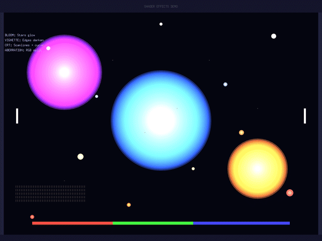

# Stapledon's Voyage

*Travel as fast as you like. Live with the consequences.*

A hard sci-fi philosophy simulator where you pilot a near-light-speed ship with just 100 subjective years to explore the galaxy. Every journey triggers brutal time dilation: while you age slowly, entire civilizations rise, evolve, and die in the centuries that pass between your visits.

## Quick Start

```bash
# Run the game (development build)
make run-mock

# Run tests
go test ./...
```

## About

You discover the one "cheat" this universe allows: a drive that lets your ship cruise arbitrarily close to the speed of light. You don't get magic, FTL messaging, or time travel — just real relativistic time dilation.

**You have 100 subjective years aboard your ship.**

Every journey costs you time — and costs the universe centuries. The civilizations you visit age, change, forget you, or die while you travel. Your crew ages with you, the one constant in a universe that keeps changing out from under you.

At the end of your life, the simulation fast-forwards to Year 1,000,000 and shows you what your choices did to the galaxy. Not what was "good" or "bad" — just what happened. You decide what it means.

## What You'll Actually See

When you travel at near-light speeds, the universe doesn't just tick by faster — it looks fundamentally different. We implement the exact physics of special relativity:



**What's happening in this animation:**
1. **Acceleration** (0 → 0.5c): Stars ahead brighten and blueshift as you speed up
2. **Looking around at 0.5c**: The "relativistic ring" — aberration compresses all starlight into a bright halo
3. **Looking backward**: Near-total darkness — light from behind is aberrated forward and out of view
4. **Deceleration**: Stars return to normal as you slow down

This isn't artistic license — these are the exact formulas from Einstein's special relativity:
- **Aberration**: cos(θ) = (cos(θ') + β) / (1 + β·cos(θ'))
- **Doppler shift**: D = γ(1 + β·cos(θ))
- **Relativistic beaming**: Intensity scales as D³

At 0.9c looking forward, incoming light is amplified ~80× (whiteout). Looking backward, it's reduced to ~1% (near-darkness). This is what interstellar travel would actually look like.

### Near Black Holes: General Relativity

When you approach massive objects like black holes, spacetime itself warps. We implement gravitational lensing based on the Schwarzschild metric:


**What's happening in this animation:**
1. **Approach**: As you get closer, the gravitational potential (φ) increases and spacetime curvature becomes visible
2. **Einstein ring**: Light from behind the black hole is bent around it, creating a bright ring at the photon sphere (r = 1.5 × Schwarzschild radius)
3. **Event horizon**: The central darkness where not even light can escape
4. **Retreat**: The lensing effect diminishes as you move away

The shader implements:
- **Gravitational lensing**: Light rays bend toward the mass, distorting the view of stars behind
- **Photon sphere glow**: At r = 1.5rs, photons orbit the black hole, creating a bright accretion ring
- **Schwarzschild radius (rs)**: The event horizon boundary — anything closer is lost forever
- **Gravitational potential (φ)**: Controls the intensity of spacetime curvature effects

This is what approaching a stellar-mass black hole would actually look like — beautiful, terrifying, and scientifically accurate.

## Design Pillars

Five non-negotiable constraints guide every feature:

| Pillar | What It Means |
|--------|---------------|
| **Choices Are Final** | No saves, no reloads. Live with consequences or start fresh. |
| **The Game Doesn't Judge** | Present facts, not morals. Players find their own meaning. |
| **Time Has Emotional Weight** | Loneliness, loss, and treasuring what remains — not just numbers. |
| **The Ship Is Home** | Crew provides human-scale grounding against cosmic-scale alienation. |
| **Grounded Strangeness** | Aliens are scientifically plausible, maximally diverse, and extensible. |

See [docs/vision/core-pillars.md](docs/vision/core-pillars.md) for full pillar definitions.

## Inspiration

Named after [Olaf Stapledon](https://en.wikipedia.org/wiki/Olaf_Stapledon), the science fiction author known for cosmic-scale narratives like *Star Maker* and *Last and First Men*. The game embodies his perspective: vast timescales, philosophical exploration, and the humbling realization of how small individual choices feel against deep time — yet how consequential they remain.

## Status

**Early Development** - The game engine is functional with relativistic visual effects. Core gameplay (civilization simulation, crew management) is not yet implemented.

The current codebase provides:
- 2D rendering engine (Go/Ebiten)
- **Special relativity shader** — physically accurate aberration, Doppler shift, and relativistic beaming
- **General relativity shader** — gravitational lensing, Einstein rings, and photon sphere effects near black holes
- Post-processing pipeline (bloom, vignette, CRT, chromatic aberration)
- Input handling and game loop
- Foundation for AILANG integration

See [docs/game-vision.md](docs/game-vision.md) for the complete game design.

## Technical

This project serves as the primary integration test for **AILANG**, a new programming language for game simulation.

| Layer | Purpose |
|-------|---------|
| **Engine** (`engine/`) | Input capture, rendering - Go/Ebiten |
| **Simulation** (`sim_gen/`) | Game logic - currently mock Go, will be AILANG |

See [CLAUDE.md](CLAUDE.md) and [DEVELOPMENT.md](DEVELOPMENT.md) for technical details.

## Releases

See [Releases](https://github.com/sunholo/stapledons_voyage/releases) for downloadable binaries.

Current version: **v0.1.0**

## Requirements

- Go 1.21+
- Make

## License

MIT
